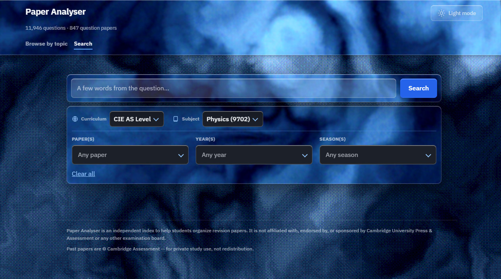

# Paper Finder

Find which past exam paper a question came from.

Type a few words of a Cambridge International (CIE) AS & A Level question and
get back the exact paper (subject, year, session, paper, variant, question
number) together with the mark-scheme answer. You can also browse every
question by syllabus topic as flashcards. The web UI is branded
**Paper Analyser**.



## How it works

A local Python pipeline downloads past-paper PDFs, extracts their text, splits
each paper into questions, links each one to its mark-scheme answer and renders
an image of it. Everything goes into a SQLite database that the CLI and the web
UI search. Fourteen subjects are covered across Physics, Chemistry, Biology,
Economics, Computer Science, Mathematics and Further Mathematics.

## Install

Requires Python 3.11 or newer.

```bash
python -m venv .venv
# Windows: .venv\Scripts\activate    macOS/Linux: source .venv/bin/activate
pip install -e ".[dev]"
```

This installs the `paper-finder` command plus the test and lint tools.

## Run it

The past papers are not in the repo (see [Copyright](#copyright)), so fetch
some first. Start small; the full scope is about 1,700 PDFs.

```bash
paper-finder download --subject 9702 --years 2024 --limit 20   # into data/raw/
paper-finder build                                             # build papers.db
paper-finder serve                                             # http://127.0.0.1:8000
```

Or search from the terminal:

```bash
paper-finder search "a few words from the question"
```

Run `paper-finder --help` for every command. The deployed version (Vercel +
Supabase, with email sign-in) is set up as described in
[`DEPLOY_PROGRESS.md`](DEPLOY_PROGRESS.md).

## Folder structure

```
src/paper_finder/       Python package: the pipeline, search and the CLI
src/paper_finder/web/   FastAPI app plus the static HTML/CSS/JS frontend
tests/                  pytest suite
labels/                 hand-checked syllabus-topic label for each question
eval/                   phrases used to measure search accuracy
supabase/migrations/    SQL schema for the deployed database
data/                   downloaded PDFs, extracted text and crops (local only, gitignored)
```

At the root, `app.py`, `vercel.json` and `requirements.txt` are for the Vercel
deployment. [`PLAN.md`](PLAN.md) has the roadmap and [`CLAUDE.md`](CLAUDE.md)
has detailed notes on the codebase.

## Contributing

1. Create a branch off `main`.
2. Make your change, then check it:
   ```bash
   ruff format .
   ruff check .
   pytest
   ```
3. Commit with a short imperative subject and a body that explains why.
4. Open a pull request.

Never commit past-paper PDFs, `papers.db` or anything under `data/`. See
[`CLAUDE.md`](CLAUDE.md) for the pipeline's conventions, such as how to add a
new subject.

## Copyright

CIE past papers are copyright of Cambridge Assessment. This is a private study
tool: the PDFs and the extracted question bank are never committed to this
repository.

Paper Finder is an independent index to help students organize revision
papers. It is not affiliated with, endorsed by, or sponsored by Cambridge
University Press & Assessment or any other examination board.
